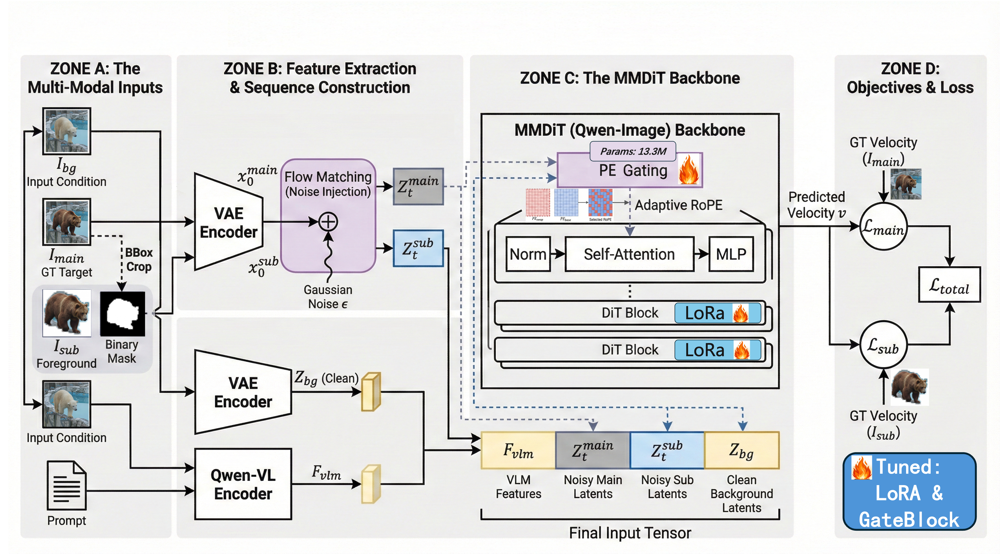

# BRIDGE: Background Routing and Isolated Discrete Gating for Coarse-Mask Local Editing

[](https://arxiv.org/abs/2605.07846)

**BRIDGE** addresses coarse-mask local image editing by separating localization support from geometry generation. It uses BridgePath (Main Path + Subject Path) and a learnable Discrete Geometric Gate for token-level positional-embedding routing.

## Overview

- **BridgePath**: Two-path generation where Main Path preserves background context and Subject Path generates editable content from independent noise
- **Discrete Geometric Gate**: Token-level PE routing that lets subject tokens borrow background-anchored coordinates near fusion regions or keep subject-centric coordinates for geometry freedom
- **Original Qwen implementation**: 13.31M GateBlock parameters (vs ~1.13B for ControlNet-style branches); this count is not the size of the FLUX full-transformer checkpoints.

## Method



**The method is shared by Qwen and FLUX:** a main path and an independently
denoised sub path interact through learned discrete positional-encoding routing.
The paper figure shows the Qwen implementation labels. **Qwen uses LoRA + gate
training; FLUX uses full-transformer + gate training.** The FLUX subject-driven
extension additionally supports generated subject-reference image conditions.
The figure's Qwen-VL, backbone and 13.3M annotations are implementation-specific,
not claims about the FLUX encoder or total fine-tuned parameter count.

## FLUX.2 Klein 9B update

BRIDGE now also includes two trained **FLUX.2 Klein 9B** variants, using the same
main/subject paths and discrete positional-encoding routing:

- **Sparse / Mask**: mask-selected sub tokens with mask-based PE exchange.
- **Dense / BBox**: a full bbox sub grid with bbox-wide PE exchange.

Both step-1400 **BF16 ScheduleFree eval** checkpoints are released alongside the
original Qwen weights on [Hugging Face](https://huggingface.co/PANDATREE/BRIDGE/tree/main/flux2-klein-9b).
See **[FLUX setup, Gradio comparison, subject inputs, sub-token control, and examples](flux2/README.md)**.
Generation uses **50 inference steps**. The FLUX weights are full transformer
states, not Qwen-compatible LoRA adapters, and carry the FLUX Non-Commercial
License. The original Qwen code and weight file remain available unchanged.

### BBox-trained weights with cropped sub tokens

At inference, the **same BBox-trained FLUX checkpoint** can retain the full bbox
sub grid or keep only mask-selected sub tokens. PE candidate pairs are changed
consistently from bbox-wide to mask-only. This controls the generated sub support
without retraining; main still generates the full image. These comparisons
change both sub support and PE candidate support, not only token count.

Below are six existing custom-input comparisons, all at **50 steps, seed=0,
no latent blending**. CFG is shown for each case (2 or 4). Both columns use the
same BBox-trained checkpoint. **Red lines mark the submitted mask boundary**,
mapped onto Main/Sub outputs; they are visualization overlays, not generated
object outlines. These are the original saved outline PNGs, not newly redrawn
images. Backgrounds, subject references and input masks are shown alongside
every case. Internal-dataset examples are excluded.

#### Example 1: 1092 → 512 Sub tokens (CFG=4)

[Prompt and parameters](flux2/examples/bbox-token-control/20260910_055214_260277_upload_custom_b62404d86a8d_d2bb1844/metadata.json) · 50 steps · seed 0 · same BBox-trained weights

| Input background | Subject reference 1 | Subject reference 2 | Input mask |
|---|---|---|---|
|  |  |  |  |

| Cropped/sparse Sub: Main output | Full bbox Sub: Main output |
|---|---|
|  |  |

| Cropped/sparse Sub output | Full bbox Sub output |
|---|---|
|  |  |

#### Example 2: 300 → 222 Sub tokens (CFG=4)

[Prompt and parameters](flux2/examples/bbox-token-control/20260910_062504_041200_upload_custom_b62404d86a8d_64eb2886/metadata.json) · 50 steps · seed 0 · same BBox-trained weights

| Input background | Subject reference 1 | Subject reference 2 | Input mask |
|---|---|---|---|
|  |  |  |  |

| Cropped/sparse Sub: Main output | Full bbox Sub: Main output |
|---|---|
|  |  |

| Cropped/sparse Sub output | Full bbox Sub output |
|---|---|
|  |  |

#### Example 3: 1178 → 677 Sub tokens (CFG=4)

[Prompt and parameters](flux2/examples/bbox-token-control/20260910_152028_209813_upload_custom_b62404d86a8d_77f7824a/metadata.json) · 50 steps · seed 0 · same BBox-trained weights

| Input background | Subject reference 1 | Subject reference 2 | Input mask |
|---|---|---|---|
|  |  |  |  |

| Cropped/sparse Sub: Main output | Full bbox Sub: Main output |
|---|---|
|  |  |

| Cropped/sparse Sub output | Full bbox Sub output |
|---|---|
|  |  |

#### Example 4: 713 → 387 Sub tokens (CFG=4)

[Prompt and parameters](flux2/examples/bbox-token-control/20260910_170030_673036_upload_custom_b62404d86a8d_93c533f0/metadata.json) · 50 steps · seed 0 · same BBox-trained weights

| Input background | Subject reference 1 | Subject reference 2 | Input mask |
|---|---|---|---|
|  |  |  |  |

| Cropped/sparse Sub: Main output | Full bbox Sub: Main output |
|---|---|
|  |  |

| Cropped/sparse Sub output | Full bbox Sub output |
|---|---|
|  |  |

#### Example 5: 1302 → 618 Sub tokens (CFG=2)

[Prompt and parameters](flux2/examples/bbox-token-control/bbox_weights_sparse_20260910_a/metadata.json) · 50 steps · seed 0 · same BBox-trained weights

| Input background | Subject reference 1 | Subject reference 2 | Input mask |
|---|---|---|---|
|  |  |  |  |

| Cropped/sparse Sub: Main output | Full bbox Sub: Main output |
|---|---|
|  |  |

| Cropped/sparse Sub output | Full bbox Sub output |
|---|---|
|  |  |

#### Example 6: 1302 → 618 Sub tokens (CFG=4)

[Prompt and parameters](flux2/examples/bbox-token-control/bbox_weights_sparse_cfg4_20260910_a/metadata.json) · 50 steps · seed 0 · same BBox-trained weights

| Input background | Subject reference 1 | Subject reference 2 | Input mask |
|---|---|---|---|
|  |  |  |  |

| Cropped/sparse Sub: Main output | Full bbox Sub: Main output |
|---|---|
|  |  |

| Cropped/sparse Sub output | Full bbox Sub output |
|---|---|
|  |  |

These are qualitative examples, not a quantitative benchmark. Unannotated outputs
and parameter records remain in the [full gallery](flux2/examples/bbox-token-control/README.md).

### Run and train FLUX

- [Environment, model downloads and Gradio](flux2/README.md)
- [Same-weight BBox versus cropped-sub Gradio mode](flux2/README.md#bbox-weight-protocol-comparison)
- [Complete FLUX data/cache/full-training/export instructions](flux2/TRAINING.md)
- [Subject-condition dataset extension](https://huggingface.co/datasets/PANDATREE/BRIDGE/tree/main/subject_condition)

The dataset extension adds **30,926 subject conditions generated with
Qwen-Image-Edit-2511**, preserving the FLUX split of **27,834 train / 3,092 test**.
It also supplies missing crop/background/mask dependencies. Original target
images remain separately obtained as explained in the dataset and training docs.

The remaining sections describe the original **Qwen** release.

## Download

### 1. Base Model (Required)

BRIDGE is built on top of Qwen-Image-Edit-2511. You must download it first:

```bash
# Coming soon: auto-download in inference script
# Model: https://huggingface.co/Qwen/Qwen-Image-Edit-2511
```

### 2. BRIDGE Model Weights

Pre-trained BRIDGE weights (STE GateBlocks + LoRA) are available on Hugging Face:

```
https://huggingface.co/PANDATREE/BRIDGE
```

Download `model.safetensors`:

```python
from safetensors.torch import load_file
state = load_file("model.safetensors")

# The checkpoint contains:
# - pipe.ste.* → GateBlocks (Discrete Geometric Gate)
# - lora_*     → LoRA adapters (rank 512)
```

### 3. Dataset

The BRIDGE training/evaluation dataset (with `global_caption`/`local_caption`) is available on Hugging Face:

```
https://huggingface.co/datasets/PANDATREE/BRIDGE
```

**Contents:**
- `dataset_qwen_pe_reversed.json` — 42,425 training pairs with captions
- `dataset_qwen_pe_top1000_captioned.json` — 1,000 evaluation pairs with captions
- `fixed_images/` — edited results (guided-filter blended)
- `ref_gt_fixed/` / `ref_gt_fixed_crop/` — reference ground truth
- `fixed_masks/` — editing region masks

> **Note:** `target_images/` (original edited outputs from Nano-Banana) are not included in this repo. Please obtain them from [Apple Pico-Banana-400K](https://github.com/apple/pico-banana-400k) (CC BY-NC-ND 4.0).

## Requirements

```bash
pip install torch torchvision
pip install -r requirements.txt
```

## Quick Start

### Gradio Demo

```bash
# Place model.safetensors at:
# train/Qwen-Image-Edit-2511_lora-rank512-cfg/step-28000.safetensors

python apps_demo/app_gradio_multi.py
```

### Inference

See `DiffSynth-Studio/examples/qwen_image/model_training/train.py` for training,
and the `evaluation/` scripts for metrics computation.

## Training

```bash
bash training/Qwen-Image-Edit-2511.sh
```

## Citation

```bibtex
@article{xiong2025bridge,
  title={BRIDGE: Background Routing and Isolated Discrete Gating for Coarse-Mask Local Editing},
  author={Peilin Xiong, Honghui Yuan, Junwen Chen, Keiji Yanai},
  journal={arXiv preprint arXiv:2605.07846},
  year={2025}
}
```

## License

The original code release is Apache 2.0. The newly added FLUX model weights are
subject to the upstream [FLUX Non-Commercial License](flux2/LICENSE-FLUX.md);
see [the FLUX notice](flux2/NOTICE-FLUX.md). Apache 2.0 does not relicense those weights.
