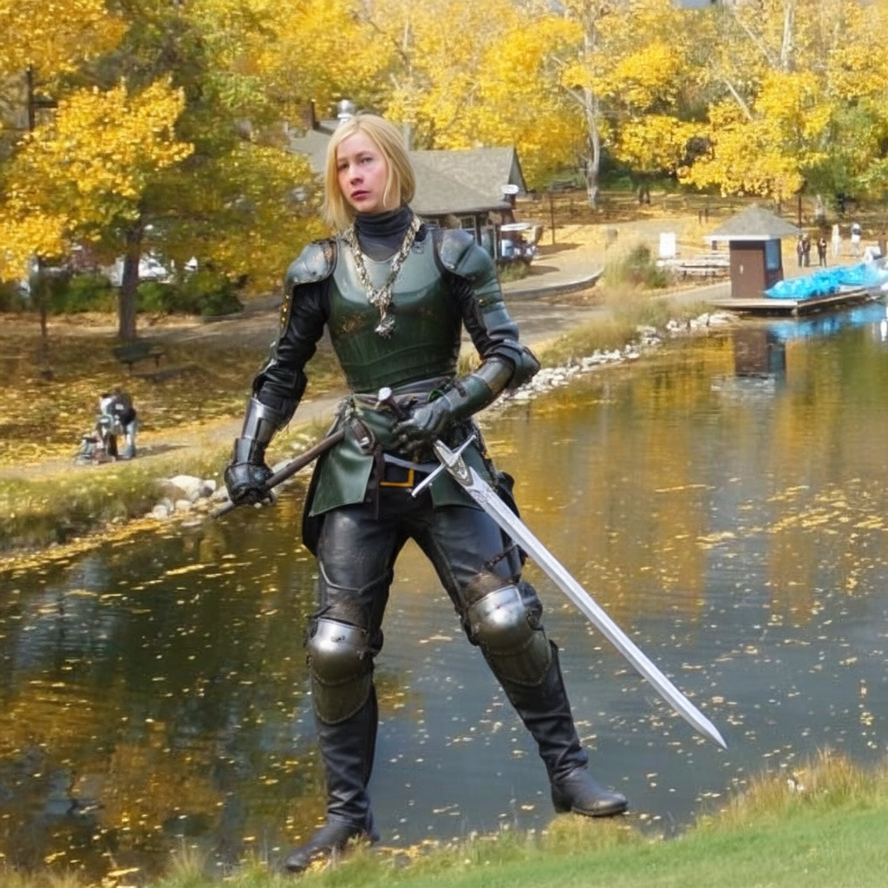
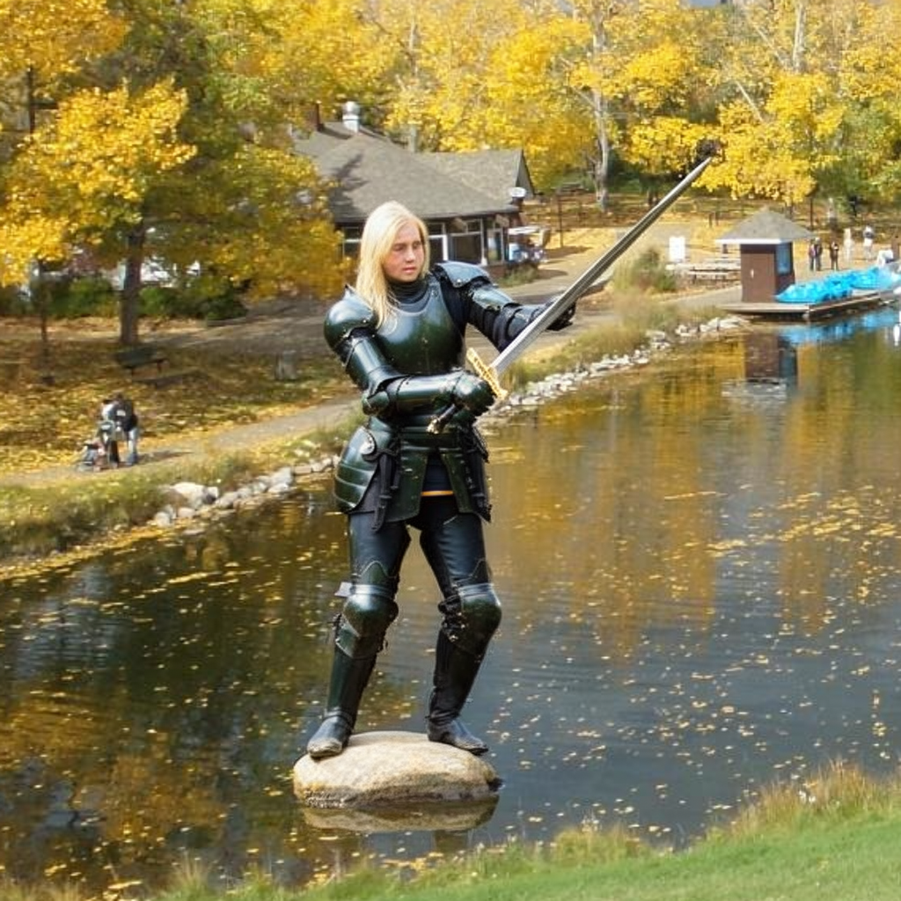
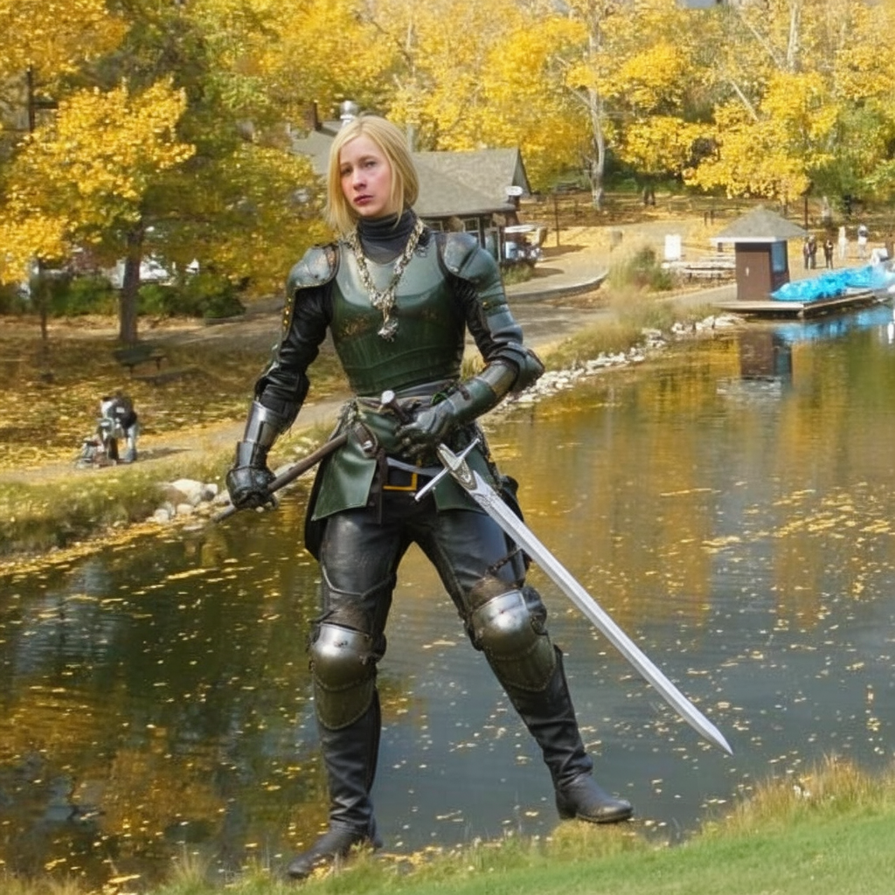
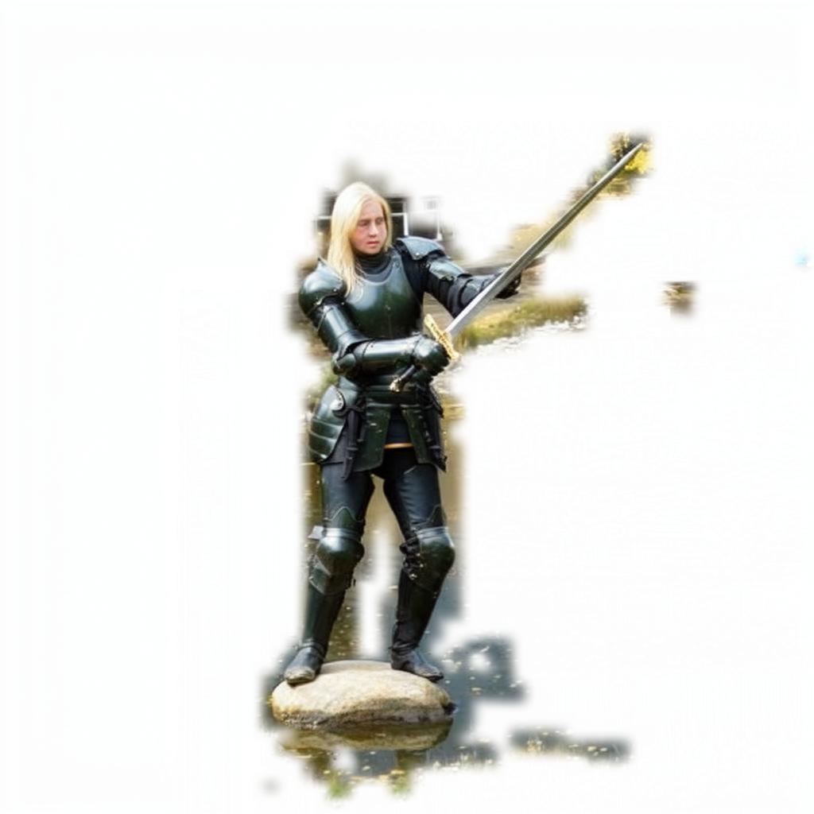

# BRIDGE: FLUX.2 Klein 9B release

This directory adds the FLUX implementation alongside the original Qwen
implementation; it does not replace the Qwen code or weights.
Both use a main path, an independently denoised subject path, and learned
discrete positional-encoding routing. The backbone and checkpoint format differ.

## Models

| Variant | Hugging Face checkpoint | Sub layout / PE exchange |
|---|---|---|
| Sparse / Mask | [sparse-mask/checkpoint-1400](https://huggingface.co/PANDATREE/BRIDGE/tree/main/flux2-klein-9b/sparse-mask/checkpoint-1400) | Mask-selected bbox-local sub tokens / mask pairs |
| Dense / BBox | [dense-bbox/checkpoint-1400](https://huggingface.co/PANDATREE/BRIDGE/tree/main/flux2-klein-9b/dense-bbox/checkpoint-1400) | Complete bbox-local grid / bbox pairs |

Both are **full BF16 transformer checkpoints including the PE gates**, not
LoRA adapters. Each is about 18.2 GB. They are the step-1400 ScheduleFree **eval**
exports referenced by the comparison Gradio launcher and the included example's
metadata. Older training-view exports are not used in this release.

The base model is `black-forest-labs/FLUX.2-klein-base-9B`. Obtain its VAE,
Qwen3 text encoder, tokenizer and scheduler separately. The released trained
transformer replaces the base transformer. Positional t-coordinates are
main=0, sub=20, conditions=40,60,80,...; these are not denoising timesteps.
**All image generation and evaluation uses exactly 50 inference steps.**

## Setup and comparison UI

Use an isolated environment for this FLUX implementation, separate from the
original Qwen/DiffSynth dependencies. The inspected environment used Python
3.13 and PyTorch 2.12.0. The pinned Diffusers commit matches the project's
vendored source (its local differences were executable-mode bits only).

```bash
cd flux2
uv venv --python 3.13 .venv
# Select the PyTorch CUDA build appropriate for your driver/GPU.
uv pip install --python .venv/bin/python torch==2.12.0
uv pip install --python .venv/bin/python -r requirements.txt

.venv/bin/hf download PANDATREE/BRIDGE \
  --include 'flux2-klein-9b/*' --local-dir ./weights

.venv/bin/python app.py --weights-dir ./weights --sparse-gpu 0 --bbox-gpu 1
```

The launcher reuses the existing Gradio comparison UI and model workers, with
one model per GPU. It binds to localhost by default and does not start the
research environment's Docker-control watchdog. Use `--server-name 0.0.0.0`
only when you intend to expose it and have arranged appropriate access control.
No service is started by downloading this code.

The base components may download on first launch; access to the base model
remains subject to its license and any Hugging Face access requirements.
For an existing local base snapshot, pass `--base-model /path/to/base/snapshot`
and optionally `--local-files-only`. The original comparison configuration
used base revision `32773329fbe7e81a90ef971740e8ba4b0364ecf3`.
This is a BF16 full-model workflow, not a low-VRAM or quantized demo.

The backends can also be imported directly:

```python
from gradio_subject_backend import SubjectDrivenGradioBackend
from gradio_subject_bbox_backend import BBoxSubjectDrivenGradioBackend

# Instantiate one of these classes with checkpoint_path=<checkpoint directory>,
# pretrained_model_name_or_path=<base snapshot>, and device=<your device>.
# The checkpoint path is the parent of transformer/, not transformer/ itself.
```

Loading through these backends restores the gate modules explicitly and checks
for missing/unexpected trained parameters. Loading only a standard base
Diffusers transformer is insufficient.

## Subject inputs and sub-token control

The UI accepts a background, a prompt, up to three subject-reference images,
and a drawn/uploaded region mask. Three references is an interface capability,
not a statement about the training reference count. Subject references provide
image conditions; the generated sub branch is a separate noisy latent sequence.

In **sparse** mode, the code creates independent Gaussian noise on the bbox-local
grid, then keeps only the tokens selected by the mask. Thus removing support
within a bbox removes the corresponding sub tokens before denoising, providing
a way to influence generation within that region. Selection is quantized to
16-by-16-pixel token cells with outward mask pooling. Keep the same bbox extents
when comparing interior token removal; changing the outer mask also changes
the crop and coordinate mapping.

In **dense-bbox** mode, the full bounding rectangle is retained. A hole in the
input mask does not remove interior tokens in this variant. Neither variant
initializes sub by slicing main/background token values, and PE routing changes
positional embeddings rather than exchanging latent values.

This documents the existing mask-driven sparse-token mechanism and the authors'
qualitative observation. It is not a new arbitrary-token-cut UI, a quantitative
ablation result, or a guarantee of pixel-exact geometry control.

With **No Mask (full-size Sub)**, both models keep a full-image sub branch.
The Gradio default is global sub spatial IDs; selecting local IDs retains
crop-local coordinates consistent with training. These modes should be recorded
when comparing results.

## Existing example (AI-generated outputs)

The following are unmodified outputs saved by Gradio on **2026-09-04**. They use
the two released eval checkpoints, 1024x1024 output, 50 steps, seed 0, CFG 4.0,
CFG-Zero* enabled with one zero-init step, two subject references, and global
sub spatial IDs. **No mask was supplied: the sub branch covers the full image.**
This is not a token-removal comparison or a new quality benchmark.

| Sparse / Mask checkpoint | Dense / BBox checkpoint |
|---|---|
|  |  |
|  |  |

See [example metadata](examples/20260904-full-sub/metadata.json) for the prompt,
settings, image hashes and checkpoint identities. Input photographs and raw
attention/gate dumps are not redistributed in this release.
The unchanged source backend uses CUDA RNG when run on CUDA; these historical
images must not be relabeled as CPU-RNG outputs. No new image generation was
performed during packaging, and changing the random-generator device can change
the output at the same seed.

## Subject-driven training data

The current project has a subject-driven training path, distinct from the old
Qwen coarse-edit dataset. Its documented manifest is
`dataset_qwen_subject_driven_best_of_three_mapped_abs_train.json`. In the raw
loader, `image` supplies the target, `ref_gt` the background, and `back_mask`
the region mask; the subject reference defaults to `ref_gt_crop`, with a fallback
to the first `edit_image` entry.
The cached sparse training path requires **`subcrop_sparse_*` tensors from the
subject crop**, never background-token slices. Dense-bbox training uses the
complete subject crop. The sub branch is at positional t=20.

This release adds model weights, inference code and examples, **not a new dataset
upload**. Do not assume that the old `PANDATREE/BRIDGE` dataset already contains
the newer subject-driven training data. A separately verified, portable data
manifest and redistribution scope are still needed for a dataset release.

## Verification and provenance

The checkpoint release manifests include SHA-256 checksums. Packaging verifies
the shard indexes, tensor shapes/data sizes, BF16 dtype and eval-conversion
provenance. Source snapshot provenance is recorded in `source_manifest.json`.
The original research workspace is not modified by the public packaging changes.

```bash
PYTHONPATH=. .venv/bin/python -m unittest discover -s tests -v
```

These are CPU unit/shape checks, not a new 50-step GPU inference benchmark.
The only public-copy changes to the existing comparison code are disabled
host-specific Docker-stop defaults; `app.py` provides portable paths and does
not invoke the watchdog. Model, gate, denoising, and RNG code is retained.

## License

The FLUX weights are subject to the [FLUX Non-Commercial License](LICENSE-FLUX.md),
with the [attribution and modification notice](NOTICE-FLUX.md). The repository's
Apache-2.0 code license and original Qwen release do **not** relicense the FLUX
weights. These derivatives are not official or endorsed Black Forest Labs models.
