# BBox weights: control through sparse sub-token support

All six examples below use **the same BBox-trained checkpoint** in two inference
layouts. Left: retain only mask-selected sub tokens and mask PE pairs.
Right: retain the full bbox sub grid and bbox PE pairs. Main still generates
the full image. No new training is needed to switch these inference layouts.
Both token support and PE candidate support change, not only token count.
All runs use 50 steps and no latent blending. Images are original saved results.
The three internal-dataset examples are deliberately excluded.

These illustrate the authors' qualitative observation, not a quantitative benchmark.

## bbox_weights_sparse_20260910_a

CFG 2.0; seed 0; sub tokens 1302 → 618.

[Parameters and provenance](bbox_weights_sparse_20260910_a/metadata.json) · [Mask](bbox_weights_sparse_20260910_a/input_mask.png) · [Background](bbox_weights_sparse_20260910_a/input_background.png)

| BBox weights + cropped/sparse sub | Same BBox weights + dense sub |
|---|---|
|  | 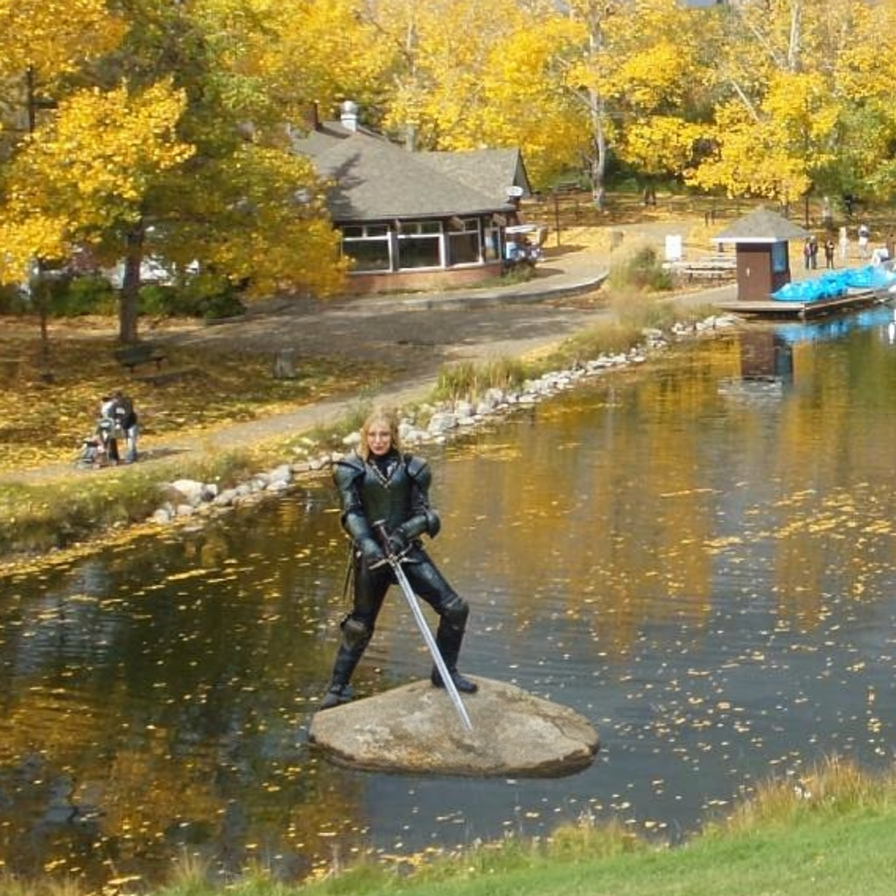 |
| 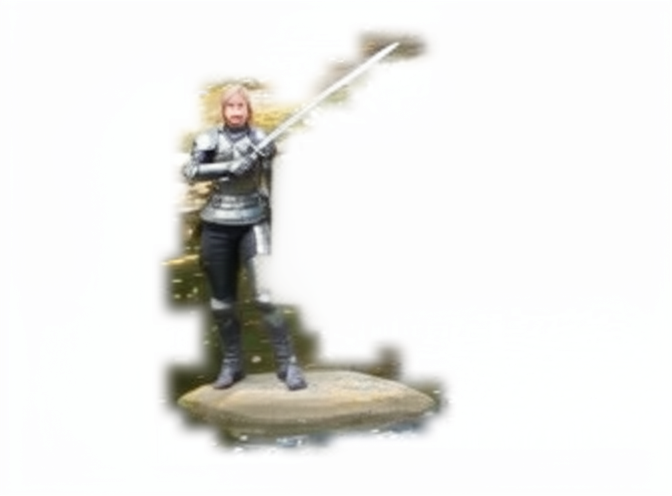 | 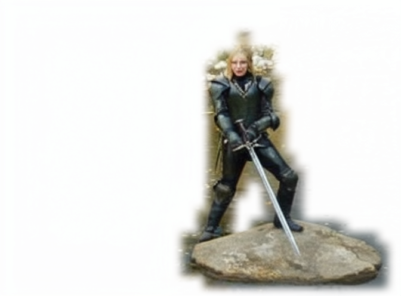 |

## bbox_weights_sparse_cfg4_20260910_a

CFG 4.0; seed 0; sub tokens 1302 → 618.

[Parameters and provenance](bbox_weights_sparse_cfg4_20260910_a/metadata.json) · [Mask](bbox_weights_sparse_cfg4_20260910_a/input_mask.png) · [Background](bbox_weights_sparse_cfg4_20260910_a/input_background.png)

| BBox weights + cropped/sparse sub | Same BBox weights + dense sub |
|---|---|
|  |  |
| 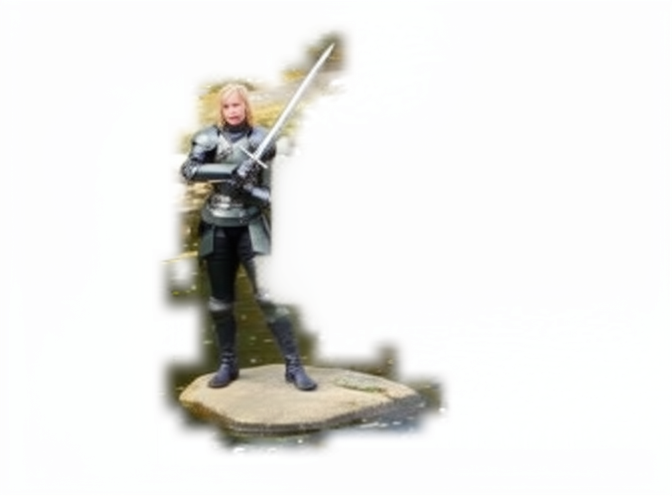 | 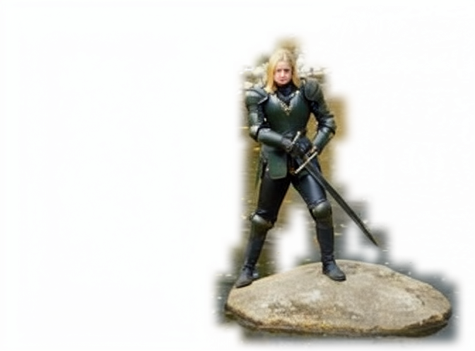 |

## 20260910_055214_260277_upload_custom_b62404d86a8d_d2bb1844

CFG 4.0; seed 0; sub tokens 1092 → 512.

[Parameters and provenance](20260910_055214_260277_upload_custom_b62404d86a8d_d2bb1844/metadata.json) · [Mask](20260910_055214_260277_upload_custom_b62404d86a8d_d2bb1844/input_mask.png) · [Background](20260910_055214_260277_upload_custom_b62404d86a8d_d2bb1844/input_background.png)

| BBox weights + cropped/sparse sub | Same BBox weights + dense sub |
|---|---|
|  | 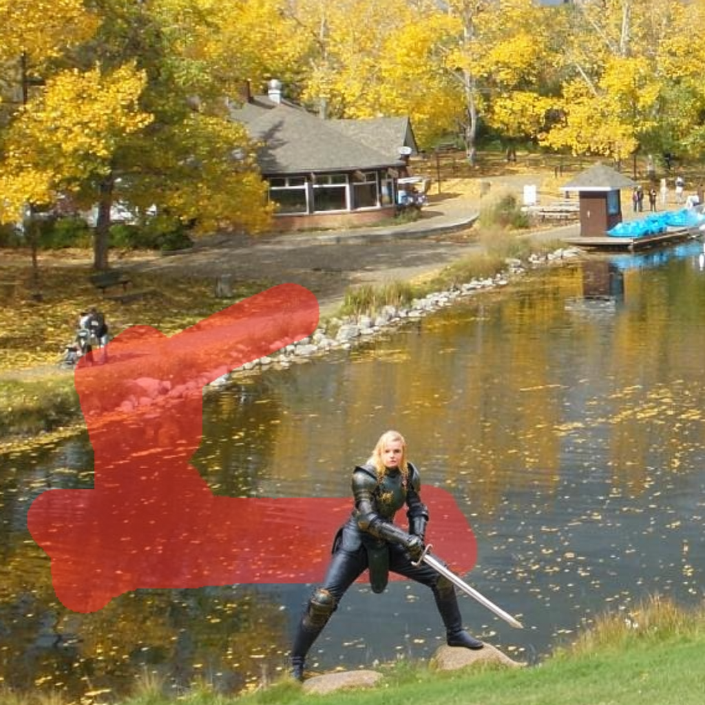 |
| 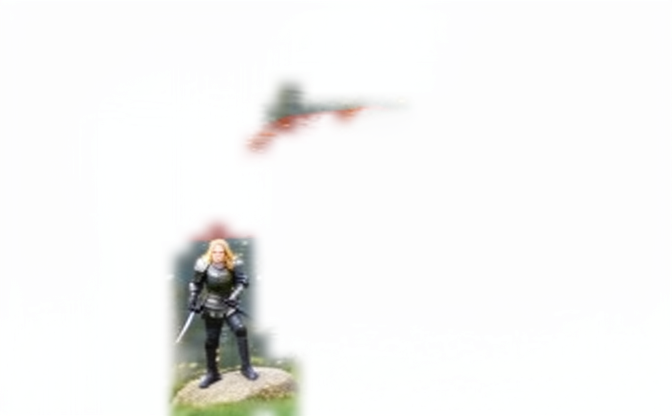 | 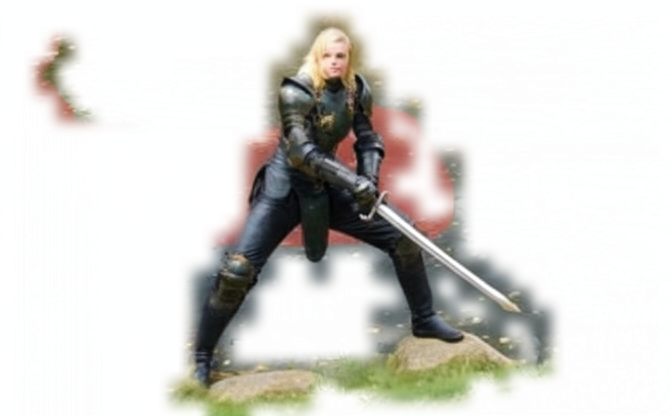 |

## 20260910_062504_041200_upload_custom_b62404d86a8d_64eb2886

CFG 4.0; seed 0; sub tokens 300 → 222.

[Parameters and provenance](20260910_062504_041200_upload_custom_b62404d86a8d_64eb2886/metadata.json) · [Mask](20260910_062504_041200_upload_custom_b62404d86a8d_64eb2886/input_mask.png) · [Background](20260910_062504_041200_upload_custom_b62404d86a8d_64eb2886/input_background.png)

| BBox weights + cropped/sparse sub | Same BBox weights + dense sub |
|---|---|
|  |  |
| 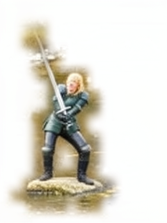 | 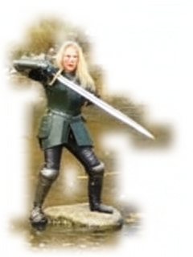 |

## 20260910_152028_209813_upload_custom_b62404d86a8d_77f7824a

CFG 4.0; seed 0; sub tokens 1178 → 677.

[Parameters and provenance](20260910_152028_209813_upload_custom_b62404d86a8d_77f7824a/metadata.json) · [Mask](20260910_152028_209813_upload_custom_b62404d86a8d_77f7824a/input_mask.png) · [Background](20260910_152028_209813_upload_custom_b62404d86a8d_77f7824a/input_background.png)

| BBox weights + cropped/sparse sub | Same BBox weights + dense sub |
|---|---|
|  | 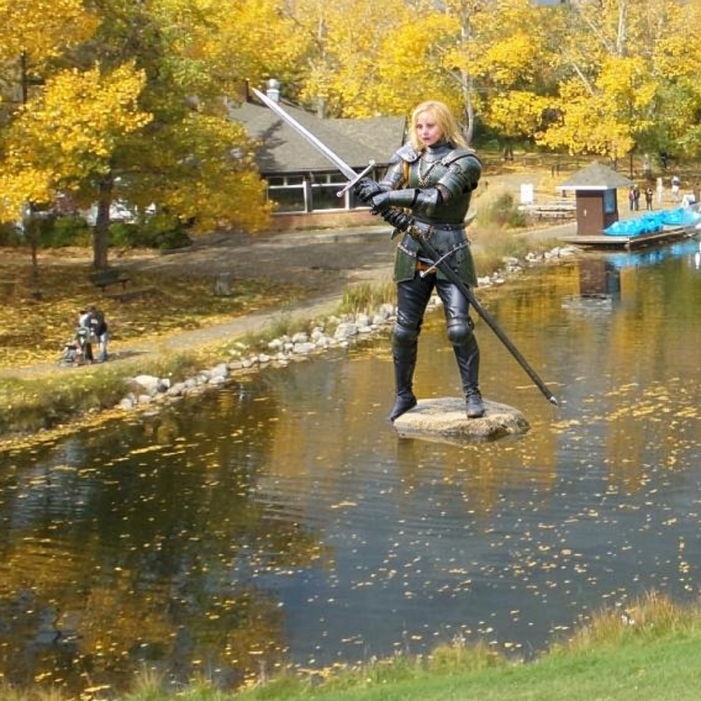 |
|  | 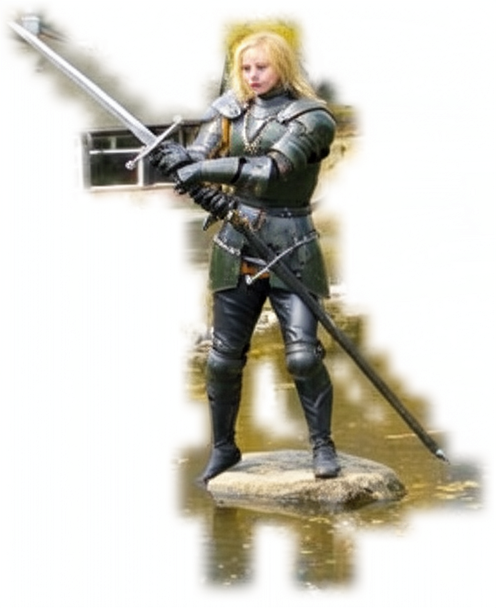 |

## 20260910_170030_673036_upload_custom_b62404d86a8d_93c533f0

CFG 4.0; seed 0; sub tokens 713 → 387.

[Parameters and provenance](20260910_170030_673036_upload_custom_b62404d86a8d_93c533f0/metadata.json) · [Mask](20260910_170030_673036_upload_custom_b62404d86a8d_93c533f0/input_mask.png) · [Background](20260910_170030_673036_upload_custom_b62404d86a8d_93c533f0/input_background.png)

| BBox weights + cropped/sparse sub | Same BBox weights + dense sub |
|---|---|
|  |  |
| 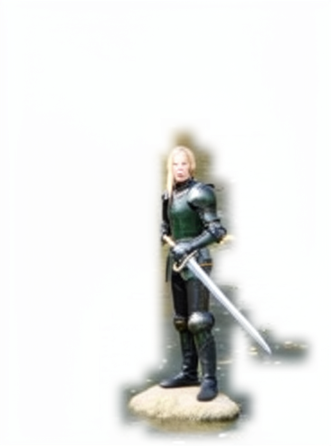 | 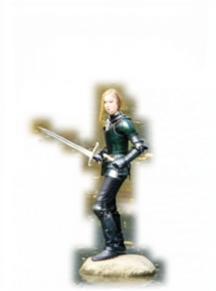 |
